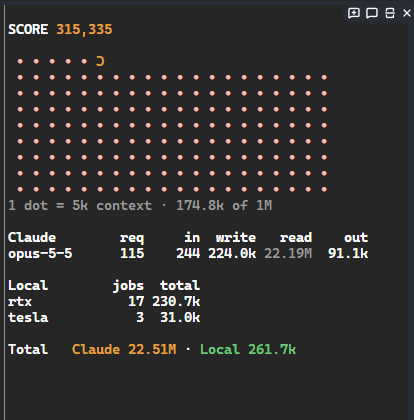

# claude-mods

A Claude Code plugin marketplace for Claude Mods. Mods are built from function hooks and are GA in Claude Code v2.1.287 (on by default). Each mod is a folder: `token-meter` and `matrix-rain`. More mods will be added as folders.

## Install

Run these commands in Claude Code:

```
/plugin marketplace add an80sPWNstar/claude-mods
/plugin install token-meter@claude-mods
/plugin install matrix-rain@claude-mods
```

Install either one or both.

Requires Claude Code 2.1.287 or newer. Built and tested in the terminal CLI (fullscreen layout, pane docked beside the transcript).

## token-meter

Shows how many tokens THIS session has used, Claude and local LLMs side by side, as plain numbers (no percentages, no account-wide usage).



1. **Status line:** `Claude 22.51M (22.19M cached) · Local 261.7k`. Claude = input + output + cache read + cache write for every model step in the session. The number in parentheses is the cache-read part.
2. **Spinner:** while Claude works, the spinner line ends with `… · Claude +18.4k this turn` (tokens since your last message).
3. **`/tokens` pane:**
   - `SCORE 315,335`: fresh tokens this session (input + output + cache write; cache reads not counted).
   - A Pac-Man maze: 200 peach dots in 10 rows of 20, one dot per 5k tokens of a 1M context window. Pac-Man's position is how full the context is right now (size of the latest main-thread request). He snakes left to right, then right to left, eats his way forward as the context grows, chomps while fresh tokens are flowing, and the board refills when the conversation is compacted. Below it: `1 dot = 5k context · 174.8k of 1M`.
   - A table per Claude model (requests, input, cache write, cache read, output) and per local box (jobs, total), then a Total line `Claude 22.51M · Local 261.7k`. Below 54 columns of pane width the table switches to narrower columns.

### Local models

token-meter counts local LLM usage by reading the job records of **lanllm** (https://github.com/an80sPWNstar/lanllm), a Claude Code plugin by the same author that lets Claude delegate work to local LLM servers (llama.cpp boxes on your LAN). token-meter does not talk to local models itself. It reads `~/.lanllm/jobs/<session-id>/*.json` every 20 seconds and adds up prompt + completion tokens per box. lanllm files each job under the Claude Code session id (it reads the `CLAUDE_CODE_SESSION_ID` variable), so only this session's local work is counted. Without lanllm, the Local numbers stay at 0 and everything else works.

### Subagent guard

Opinionated: when Claude launches a subagent:
- no model given: it is rewritten to Haiku;
- a model other than Haiku, or a fork: the launch is refused once with the reason "routing rule is Haiku first unless Haiku already failed at this task"; issuing the identical call again lets it through;
- Haiku and agent-team teammates pass untouched.

If you do not want this, the guard is the `agent.spawn` hook in `token-meter/hooks/register.tsx`.

### Tuning

Constants at the top of `token-meter/hooks/tally.ts`: `CTX_WINDOW` (1000000), `CTX_DOT` (5000 tokens per dot), `CTX_DOTS` (200), `ROW` (20 dots per row), `ROWS` (10). They are separate literals, so change them together (`CTX_DOTS = CTX_WINDOW / CTX_DOT`, `ROWS = CTX_DOTS / ROW`), update the `5k` in `ctxLabel`, and update `tests/ctx.test.ts`. Colors are in `toneProps` in `token-meter/hooks/register.tsx`: amber `#e8a33d` (Claude), green `#6bcb77` (local), peach `#ffb8ae` (dots), bold yellow `#ffff00` (Pac-Man).

### What it touches

Reads: the env vars USERPROFILE / HOME (to find ~/.lanllm), files under ~/.lanllm/jobs/<session-id>/. Writes: only its own plugin store (session totals and the last context size, so a reload keeps the counts). No network, no processes.

## matrix-rain

Matrix digital rain in green katakana-style glyphs. Pure eye candy, no effect on Claude.

- **`/matrix`** opens a docked rain pane (asks for 48 columns); `/matrix` again closes it.
- **Band:** while Claude is working, a few rows of rain fall above the prompt and stop when the turn ends. On by default; `/matrix band` toggles it, and the choice is remembered across sessions.

What it touches: only its own plugin store (the band on/off setting). No files, no network, no processes.

## Development

The tests cover the pure functions (`token-meter/hooks/tally.ts`, `matrix-rain/hooks/rain.ts`). From the repo root:

```
claude plugin validate token-meter
claude plugin test token-meter
claude plugin validate matrix-rain
claude plugin test matrix-rain
```

Type-check with `tsc -p token-meter` (or `matrix-rain`) after Claude Code has loaded the mod once (it writes `.claude-plugin/types/`, which is git-ignored).

## License

MIT
